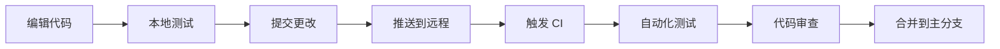

# ByteDanceDemo 开发者入门指南

欢迎来到 ByteDanceDemo！本指南将帮助你在 5 分钟内快速上手项目开发。

## 📋 前置条件

### 必需工具

- **Go**: 1.20 或更高版本
  ```bash
  go version  # 需要 1.20.x
  ```

- **Git**: 版本控制工具
  ```bash
  git --version
  ```

- **编辑器**: 推荐使用 VS Code 或 GoLand
  - VS Code: 安装 Go 扩展
  - GoLand: 轻量级 Go IDE

### 推荐工具（可选）

```bash
# 安装 Go 插展
go install -v github.com/golang/vscode@latest

# 安装 golangci-lint（代码检查）
go install -v github.com/golangci/golangci-lint/cmd/golangci-lint@latest

# 安装 swag（API 文档生成）
go install -v github.com/swaggo/swag/cmd/swag@latest
```

## 🚀 快速开始

### 步骤 1：克隆项目

```bash
# 克隆仓库
git clone https://github.com/yourusername/ByteDanceDemo.git
cd ByteDanceDemo

# 查看项目结构
ls -la
```

项目目录结构：
```
ByteDanceDemo/
├── cmd/                    # 命令行接口
├── config/                 # 配置文件
├── controller/              # HTTP 请求处理
├── service/                 # 业务逻辑层
├── repository/              # 数据访问层
├── model/                  # 数据模型
├── middleware/              # 中间件
├── router/                 # 路由配置
├── database/               # 数据库连接
├── utils/                  # 工具函数
└── ...
```

### 步骤 2：配置项目

```bash
# 国内用户设置代理（必需）
export GOPROXY=https://goproxy.cn,direct
export GOSUMDB=off

# 复制配置文件
cp config/settings.yml.template config/settings.yml

# 编辑配置文件（如需要）
# nano config/settings.yml
```

### 步骤 3：安装依赖

```bash
# 下载依赖
go mod download

# 验证依赖
go mod verify
```

### 步骤 4：配置数据库

```bash
# 登录 MySQL
mysql -u root -p

# 创建数据库
CREATE DATABASE sample_douyin CHARACTER SET utf8mb4 COLLATE utf8mb4_unicode_ci;

# 导入初始数据
mysql -u root -p sample_douyin < config/init.sql

# 创建数据库用户
CREATE USER 'sample_douyin'@'localhost' IDENTIFIED BY 'sample_douyin';
GRANT ALL PRIVILEGES ON sample_douyin.* TO 'sample_douyin'@'localhost';
FLUSH PRIVILEGES;
```

### 步骤 5：运行应用

```bash
# 构建应用
make build

# 运行迁移
make run-migrate

# 启动 API 服务
make run-api
```

验证安装：

```bash
# 测试 API
curl http://localhost:8080/douyin/feed/
```

预期响应：
```json
{
  "status_code": 0,
  "status_msg": "",
  "video_list": []
}
```

## 🏗️ 代码结构理解

### 分层架构

ByteDanceDemo 采用标准的分层架构：

```
Controller (处理 HTTP 请求)
    ↓
Service (业务逻辑)
    ↓
Repository (数据访问)
    ↓
Database (MySQL)
```

### 目录说明

| 目录 | 用途 | 说明 |
|-------|------|------|
| `controller/` | 控制器 | 处理 HTTP 请求和响应 |
| `service/` | 服务 | 业务逻辑实现 |
| `repository/` | 仓库 | 数据访问层 |
| `model/` | 模型 | 数据模型定义 |
| `middleware/` | 中间件 | 请求拦截和处理 |
| `router/` | 路由 | API 路由配置 |
| `database/` | 数据库 | 数据库连接管理 |
| `utils/` | 工具 | 辅助函数 |

## 🔧 开发工作流

### 典型工作流



### 分支策略

```bash
# 主分支
main          # 生产环境

# 开发分支
develop       # 开发环境

# 功能分支
feature/*      # 新功能
bugfix/*       # Bug 修复
hotfix/*       # 紧急修复

# 发布分支
release/*      # 版本发布
```

### 提交信息规范

```bash
# 功能添加
git commit -m "feat: add video upload feature"

# Bug 修复
git commit -m "fix: resolve login error in user service"

# 文档更新
git commit -m "docs: update API documentation"

# 性能优化
git commit -m "perf: optimize database query performance"

# 重构
git commit -m "refactor: improve code structure"
```

## 💡 调试技巧

### 使用 VS Code 调试

1. **设置断点**
   - 在代码行号左侧点击设置断点
   - 使用 F5 或 F9 继续执行
   - 使用 F10 跳过函数

2. **查看变量**
   - 将鼠标悬停在变量上
   - 使用 Shift+F12 查看变量详情

3. **调试控制台**
   - `Ctrl + ~` 打开/关闭调试控制台
   - 使用 `fmt.Println()` 打印调试信息

### 使用 Delve 调试器

```bash
# 安装 Delve
go install github.com/go-delve/delve/cmd/dlv@latest

# 调试运行中的应用
dlv attach $(pgrep simple-demo)

# 调试测试
dlv test ./service/userService_test.go
```

### 查看日志

```bash
# 查看应用日志
tail -f logs/bytedancedemo.log

# 查看错误日志
tail -f logs/error.log

# 搜索特定错误
grep "ERROR" logs/bytedancedemo.log
```

## 🧪 测试代码

### 运行单元测试

```bash
# 运行所有测试
make test

# 运行特定包测试
go test -v ./service/

# 运行特定测试
go test -v -run TestUserServiceInsertUser ./service/
```

### 运行集成测试

```bash
# 确保 API 服务在运行
make run-api

# 运行集成测试
make test-integration
```

### 生成覆盖率报告

```bash
# 生成覆盖率报告
make test-coverage

# 在浏览器中查看
open coverage.html
```

### 使用 Mock

```go
// 创建 Mock 对象
mockDAO := NewMockUserDAO(ctrl)

// 设置期望行为
mockDAO.EXPECT().FindByID(gomock.Eq(1), gomock.Any()).Return(expectedUser, nil)

// 使用 Mock
userService := NewUserService(mockDAO)
user, err := userService.GetByID(1)
```

## 🔄 常见开发任务

### 任务 1：添加用户头像上传功能

```go
// 1. 在 controller/user.go 添加处理函数
func UploadAvatar(c *gin.Context) {
    // 实现文件上传逻辑
}

// 2. 在 service/userService.go 添加业务逻辑
func. (s *UserService) UploadAvatar(userID int64, avatarFile io.Reader) error {
    // 实现业务逻辑
}

// 3. 在 repository/user.go 添加数据库操作
func. (r *UserRepository) UpdateAvatar(userID int64, avatarURL string) error {
    // 实现数据库操作
}

// 4. 添加测试
func TestUserService_UploadAvatar(t *testing.T) {
    // 编写测试
}
```

### 任务 2：添加 API 速率限制

```go
// 在 middleware/rate_limit.go 实现速率限制
func RateLimitMiddleware() gin.HandlerFunc {
    // 实现速率限制逻辑
}

// 在 router/router.go 添加中间件
router.Use(RateLimitMiddleware())
```

### 任务 3：优化数据库查询

```go
// 使用索引优化查询
db.Preload("Follows").Where("FollowerID = ?", userID).Find(&follows)

// 使用批量查询代替循环查询
db.Where("ID IN ?", userIDs).Find(&users)
```

## 📚 学习资源

### Go 语言学习

- [Go 官方教程](https://tour.golang.org/) - Go 之旅
- [Go 语言规范](https://go.dev/ref/spec) - 代码规范
- [Effective Go](https://go.dev/doc/effective_go.html) - 高效 Go

### 框架学习

- [Gin 框架](https://gin-gonic.com/docs/) - Gin 文档
- [GORM 文档](https://gorm.io/docs/) - ORM 文档

### 项目相关文档

- [架构文档](../ARCHITECTURE.md) - 系统架构
- [配置参考](../CONFIGURATION.md) - 配置说明
- [部署指南](../DEPLOYMENT.md) - 部署教程
- [贡献指南](../CONTRIBUTING.md) - 开发规范
- [测试指南](TESTING_GUIDE.md) - 测试说明

## 🤝 代码风格

### 导入顺序

```go
import (
    "context"
    "fmt"
    "net/http"
    
    "github.com/gin-gonic/gin"
    "gorm.io/gorm"
    
    "bytedancedemo/controller"
    "bytedancedemo/service"
    "bytedancedemo/repository"
)
```

### 命名规范

- 包名：小写
- 文件名：小写 + 下划线
- 常量名：小写
- 私有变量：小写
- 公有变量：首字母大写

### 注释规范

```go
// 函数注释
// GetUserByID 根据用户 ID 获取用户信息
// 参数：
//   - ctx: 请求上下文
//   - userID: 用户 ID
// 返回：
//   - *User: 用户信息
//   - error: 错误信息
func (s *UserService) GetUserByID(ctx context.Context, userID int64) (*User, error) {
    // 实现
}
```

### 错误处理

```go
// 使用 fmt.Errorf 包装错误
if err != nil {
    return nil, fmt.Errorf("failed to get user: %w", err)
}

// 检查特定错误
if errors.Is(err, gorm.ErrRecordNotFound) {
    return nil, fmt.Errorf("user not found: %d", userID)
}
```

## 🔄 环境配置

### 开发环境

```yaml
settings:
  application:
    debug: true
    port: 8080
  
  mysql:
    host: "localhost"
    port: 3306
  
  redis:
    addr: "localhost:6379"
```

### 生产环境

```yaml
settings:
  application:
    debug: false
    port: 8080
  
  mysql:
    host: "mysql.prod.example.com"
    port: 3306
    username: "${MYSQL_USERNAME}"
    password: "${MYSQL_PASSWORD}"
  
  redis:
    addr: "${REDIS_ADDR}"
    password: "${REDIS_PASSWORD}"
```

## 🚀 故障排除

### 常见问题

**问题**：无法连接数据库
```bash
# 检查 MySQL 状态
sudo systemctl status mysql

# 检查 MySQL 日志
sudo tail -f /var/log/mysql/error.log

# 测试连接
mysql -u sample_douyin -p -h localhost
```

**问题**：端口被占用
```bash
# 查找占用端口的进程
sudo lsof -ti:8080

# 杀死进程
sudo kill -9 $(lsof -ti:8080)
```

**问题**：依赖下载失败
```bash
# 清理缓存
go clean -cache

# 重新下载
go mod download
```

## 📞 快速命令参考

```bash
# 构建
make build

# 运行
make run-api

# 测试
make test

# 清理
make clean

# 依赖
make deps

# 帮规检查
make lint

# 覆盖率
make coverage
```

## ✨ 完成检查

完成以下步骤验证环境配置：

- [ ] Go 1.20+ 已安装
- [ ] Git 已配置
- [ ] 项目已克隆
- [ ] 配置文件已复制
- [ ] 依赖已安装
- [ ] 数据库已创建
- [ ] 应用可以启动
- [ ] API 端点可访问

## 🎯 下一步

完成快速入门后，你可以：

1. 查看项目结构了解代码组织
2. 阅读[架构文档](../ARCHITECTURE.md)深入了解系统设计
3. 运行测试验证功能：`make test`
4. 开始你的第一个功能开发

需要帮助？查看：
- [测试指南](TESTING_GUIDE.md)
- [故障排除](../TROUBLESHOOTING.md)
- [常见问题](FAQ.md)

---

**最后更新**: 2026-04-21
